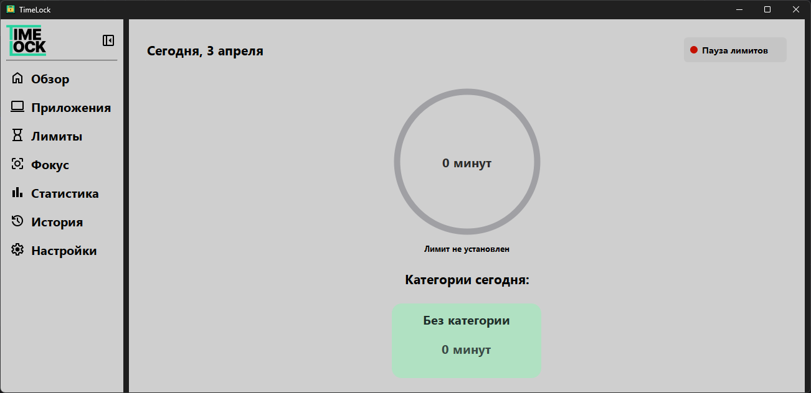
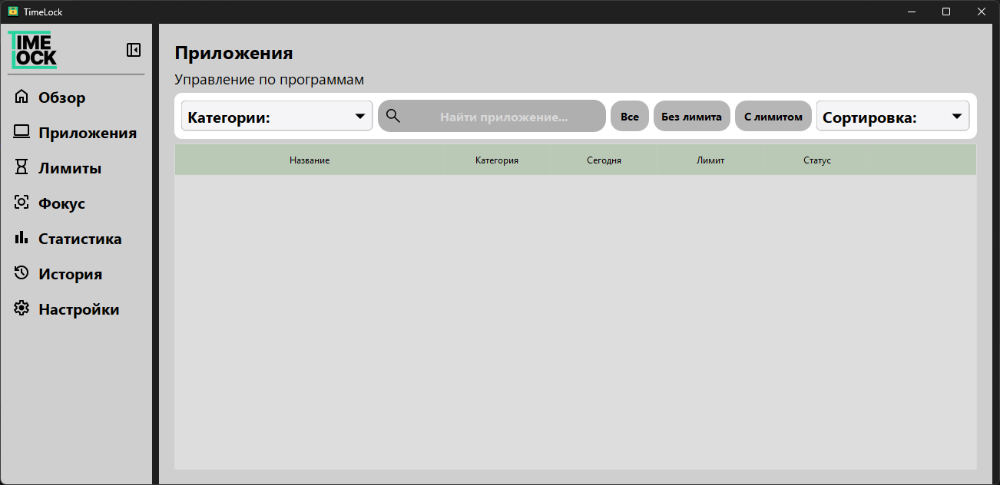
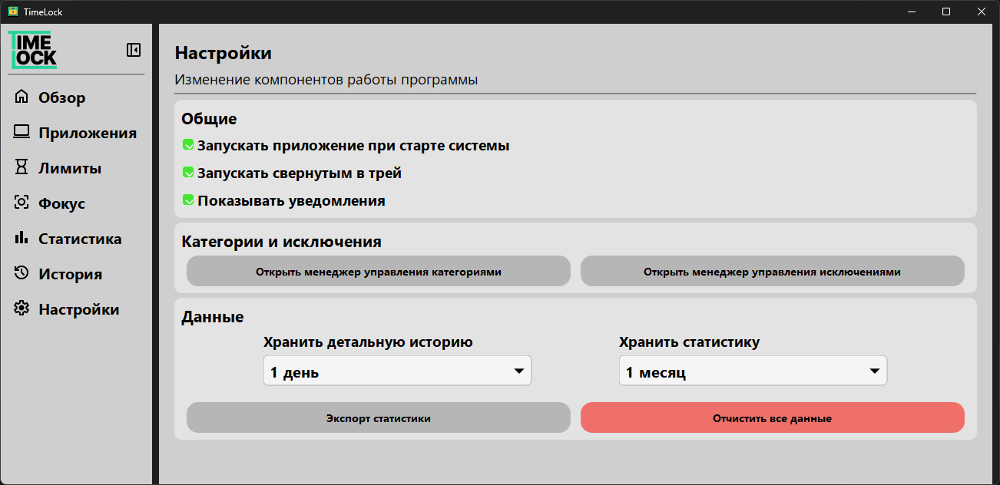

# **TimeLock**

  <b>Контроль времени за компьютером и развитие самодисциплины</b>

  

---

## Скриншоты

    
    
  

###  **Больше скриншотов в папке assets**

---

## **Поддержка платформ**

| ОС       | Статус            |
|----------|------------------|
| Windows  | ✅ Работает       |
| macOS    | ❌ Не поддерживается |
| Linux    | ❌ Не поддерживается |

---

## **Возможности**

* Отслеживание времени за компьютером
* Установка ограничений
* Контроль активности
* Развитие самодисциплины
* Фоновая работа

---

## **Функционал**

**TimeLock позволяет:**

- Следить за тем, сколько времени вы проводите за ПК  
- Ограничивать использование компьютера по времени  
- Получать уведомления при достижении лимитов  
- Анализировать свою активность  
- Работать незаметно в фоне через системный трей

---

## **Особенности**

* Запускается сразу в **системном трее
* Быстрый доступ через иконку

---

## **Установка**

1. Перейдите в раздел релизов  
2. Скачайте последнюю версию  
3. Запустите `.exe` файл  
4. Готово — приложение начнёт работу автоматически в трее

* **[Скачать последнюю версию](../../releases/latest)**

---

## **Статус**

* Активно развивается

---

## **Лицензия**

* CC BY-NC-SA 4.0

---
